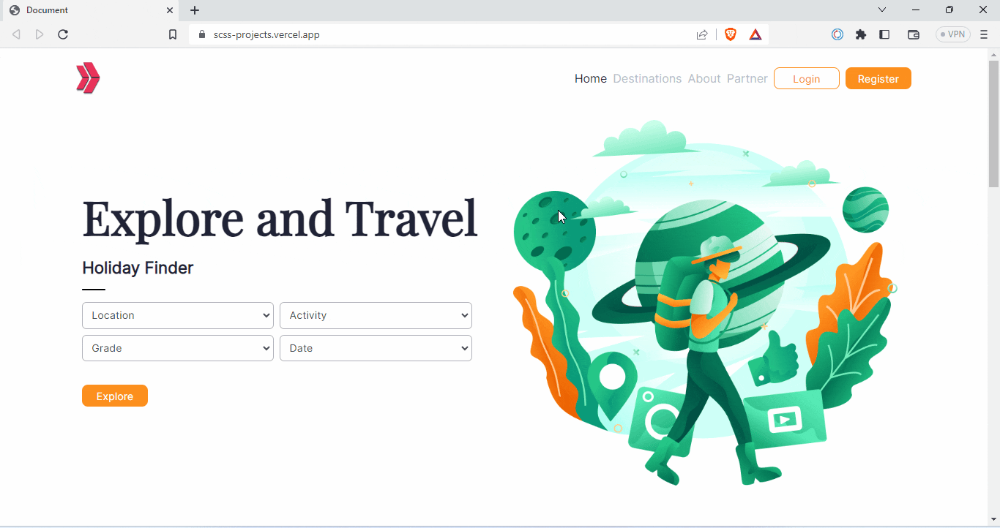

<br/>
<p align="center">
  <h1 align="center">Travel Site</h1>

  <p align="center">
    <a href="https://scss-projects.vercel.app/">View Demo</a>
  </p>
</p>


## Table Of Contents

* [About the Project](#about-the-project)
* [Built With](#built-with)
* [Getting Started](#getting-started)
  * [Prerequisites](#prerequisites)
  * [Installation](#installation)
* [Usage](#usage)
* [Authors](#authors)


## About The Project

### Project Skeleton 

```
Travel Site Project
|
|----readme.md                
|----assets            
|----solution
        |----index.html  
        |----css (folder)   
              |----style.css  
              |----style.css.map  
        |----scss (folder)   
              |----abstracts (folder) 
                    |----_mixin.scss 
                    |----_variables.scss 
              |----base (folder) 
                    |----_reset.scss               
              |----components (folder) 
                    |----_footer.scss 
                    |----_navbar.scss 
                    |----_responsive.scss 
              |----sections (folder) 
                    |----_about.scss 
                    |----_destination.scss 
                    |----_home.scss 
                    |----_guide.scss 
              |----main.scss  
```



This project is developed using Scss (Sassy Cascading Style Sheets), a CSS project. Scss is a style sheet language that adds additional features and enhanced syntax to CSS, providing more functionality and improved ease of writing.

### Features
This project incorporates the following Scss features:

- **Mixin**: @mixin rule allows for the reuse of style blocks defined with it.
- **Variable:** By using variables defined with the $ sign, it becomes possible to centrally manage values within the project.
- **For Loop:** With the @for loop, you can perform repeated operations on a specific array.
- **Extend:** The @extend rule allows you to extend style blocks to other style blocks, enabling reusability.
- **BEM Notation:** By using the Block, Element, Modifier (BEM) notation, you can structure CSS classes and better organize relationships between classes.
- **Nesting:** By using nested style rules, you can write more organized and readable code.

## Built With

Nodejs and Sass

## Getting Started

To get a local copy up and running follow these simple example steps.

### Prerequisites

* Nodejs and Sass

### Installation

1. Clone the repo

 ```sh
  git clone https://github.com/your_username_/Project-Name.git
 ```
2. Install NodeJs and Sass
<a href="https://nodejs.org/en">Download Nodejs</a>
and
```sh
npm install -g sass
```


## Usage

Open the terminal in the project directory and enter the following Sass command in your terminal:
 ```sh
    sass --watch ./scss/main.scss:./css/style.css
 ```

## Authors

* **Anthony Harold** - *Fullstack Developer* - [Anthony Harold](https://github.com/anthonyharold67/)

